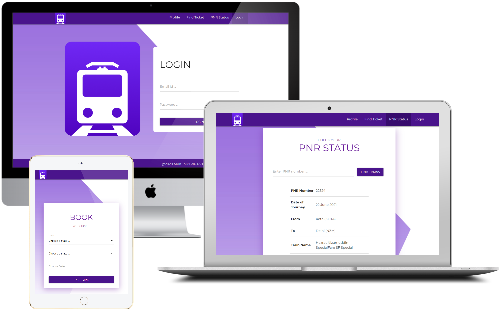

# Web Service Train Booking

## Static pages available for users to

-   Find Tickets
-   List all the available tickets
-   Book a ticket
-   View all their booked tickets
-   Check for the PNR Status

## Run

`npm start` for run the server and client
